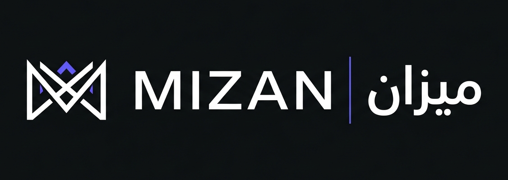

<div align="center">
  
  <h1>Mizan AI</h1>
  <p><strong>The Intelligent UAE Tax Compliance Copilot for SMEs</strong></p>
</div>

---

## 🏆 The Problem
For Small and Medium Enterprises (SMEs) in the UAE, staying compliant with the Federal Tax Authority (FTA) regulations is an arduous, time-consuming, and expensive process. Mistakes in VAT returns, improper input tax recovery claims (such as non-business or entertainment expenses), and missing TRNs lead to heavy fines. 

Current accounting tools require manual review by experts to spot compliance violations. SMEs often can't afford full-time compliance officers, leaving them exposed to significant risk.

## 💡 The Solution: Mizan AI
Mizan AI is an intelligent tax compliance copilot built for UAE SMEs. By leveraging cutting-edge LLMs and OCR, Mizan acts as a virtual auditor. It reads raw financial documents (PDFs, CSVs), maps them against UAE FTA regulations, and provides an instant compliance risk score, highlighting specific issues before a VAT return is ever filed.

### ✨ Key Features
1. **Automated Document Ingestion:** Drag and drop invoices, bank statements, expense reports, and VAT returns (PDFs/CSVs).
2. **Intelligent Extraction & Classification:** Extracts line items, VAT amounts, TRNs, and supplier details using Gemini Flash models.
3. **FTA Rules Engine:** Cross-checks expenses against UAE VAT Law (e.g., automatically flagging blocked input tax on entertainment or personal expenses).
4. **Risk Scoring & Dashboard:** Get an instant score out of 100 with a detailed breakdown of High, Medium, and Low severity issues.
5. **Interactive Copilot Chat:** Ask questions about your compliance report or FTA rules directly within the context of your uploaded documents.
6. **Audit-Ready Reports:** Export a finalized, clean PDF report detailing findings to share with external auditors or management.

---

## 🏗️ Architecture
Mizan AI is built with modern, scalable, and fast web technologies, designed to handle document processing securely.

- **Frontend:** Next.js (App Router), React, Tailwind CSS, TypeScript
- **Backend:** Next.js API Routes (Serverless)
- **Database & Storage:** Supabase (PostgreSQL & Object Storage)
- **AI/LLM Engine:** Google Gemini (1.5 / 2.0 Flash) for high-speed document extraction and compliance reasoning
- **Deployment:** Vercel

```mermaid
graph TD
    A[User Uploads Documents] --> B[Supabase Storage]
    B --> C[Gemini AI Extraction & Analysis]
    C --> D[Compliance Rules Engine]
    D --> E[Supabase DB (Save Analysis)]
    E --> F[Dashboard & Risk Report]
    F --> G[Interactive Chat / PDF Export]
```

---

## 🚀 Getting Started (Local Development)

To run Mizan AI locally and test its capabilities:

### 1. Clone the repository
```bash
git clone https://github.com/Justine-paras/Mizan-AI.git
cd Mizan-AI
```

### 2. Install dependencies
```bash
npm install
```

### 3. Configure Environment Variables
Copy the example `.env` file or create a `.env.local` in the root of the project. You can also configure this dynamically via the UI in Local Development mode.
```env
NEXT_PUBLIC_SUPABASE_URL=your_supabase_url
NEXT_PUBLIC_SUPABASE_ANON_KEY=your_supabase_anon_key
SUPABASE_SERVICE_ROLE_KEY=your_service_role_key
GEMINI_API_KEY=your_google_gemini_api_key
```

### 4. Run the development server
```bash
npm run dev
```
Open [http://localhost:3000](http://localhost:3000) in your browser.

---

## 🧪 Testing with Sample Data
We have provided comprehensive, realistic sample datasets to test the AI's compliance reasoning. Look inside the `sample-inputs/` directory:
- **Set 1 (Catering Co):** Standard operations, mix of utilities and staff costs.
- **Set 2 (Tech Consultancy):** Rich with compliance flags (blocked entertainment expenses, client gifts, personal items). Highly recommended to test Gemini's ability to catch violations.
- **Set 3 (Retail Trading):** Includes import duties and complex payroll structures.

---

## 🔮 Future Roadmap (Beyond MVP)
While built as a robust MVP, the vision for Mizan AI scales much further:
- **Direct Accounting Integration:** Native integrations with Xero, QuickBooks, and Zoho Books to pull ledger data automatically.
- **Real-Time FTA Updates:** Live-syncing with the latest Federal Decree-Law amendments to ensure rules are never outdated.
- **Multi-Tenancy for Audit Firms:** Allow tax consultants to manage multiple SME clients from a single centralized agency dashboard.

---
<div align="center">
  <i>Built with precision for UAE SME compliance.</i>
</div>
